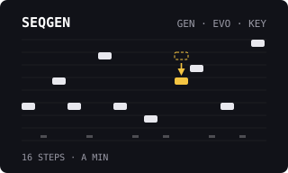

# SEQGEN

Version: `0.1.0-experimental` · author: [@yes0have0some](https://github.com/yes0have0some)

Generate, evolve and scale-lock a phrase on any Octatrack audio track. SEQGEN writes real trigs and locks, and the stock sequencer plays them. ColdFire only: no DSP code and no effect slot. For original OS 1.40C (MKI and MKII share the image).

**Development draft.** The engine passes firmware-free sanitizer tests, and the native page was walked under the headless ColdFire emulator (MKI and MKII panels). The performance record and hardware results are still pending (see [TESTING.md](TESTING.md)). Nothing below is claimed to run on a unit yet.

## Overview

SEQGEN is inspired by the five12 Vector sequencer's generators, evolve operations and scale locking. It writes into the selected audio track of the current pattern:

- note trigs, slides
- PTCH, AMP HOLD and AMP VOL locks
- optionally, stock X% trig conditions, micro-timing and RTRG/RTIM locks

Then it gets out of the way: the stock sequencer plays what it wrote. Transport, tempo, track speed, track length and scale, swing and Swing All stay the instrument's own, and SEQGEN keeps no clock of its own. Everything it writes stays ordinary, editable pattern data that saves with the project.

The algorithms are original; they are modelled on the behaviour the Vector user guide describes and are not note-for-note identical to Vector. No five12 code, firmware or assets are used.

## Controls

Three pages of six controls. Turning any GEN control regenerates with the current seed.

| Page | Enc | Control | Default | Range and behaviour |
|---|---|---|---|---|
| GEN | A | ALGO | ACID | ACID (16ths, stepwise, octave jumps, slides), BARL (8ths, root/octave/fifth), CELL (3/5/7-step cell repeated), OBLQ (2–7-step cell that drifts each repeat), RAND, EUCL (Euclidean gates on the root), TEKN (small pitch set), MIRR (2/4/8-tone cell mirrored with swaps), DRUM (trigs only, no pitch locks) |
| GEN | B | DENS | 10 | 0–16. Share of steps with notes; 0 is silence. EUCL: pulse count. TEKN: pitch-set size. |
| GEN | C | SPAN | 12 | 0–12 semitones either side of neutral PTCH, within the scale. |
| GEN | D | GATE | 32 | Base AMP HOLD in stock units. 127 is INF and ties consecutive notes with slides. |
| GEN | E | ACNT | 48 | 0–127. How much quieter unaccented notes are than the Part's AMP VOL (written as VOL locks). |
| GEN | F | SEED | 1 | 0–127. The variation. YES advances it. |
| EVO | A | EVO | LOW | LOW, MED, HIGH (stronger pitch moves; MED/HIGH also add and remove notes), SWIZ (shuffle pitch, gate and volume between steps), SW-P, SW-G, SW-V (shuffle one lane). |
| EVO | B | AMNT | 25 | 0–100 %. Share of steps an evolve touches. |
| EVO | C | AUTO | OFF | OFF, or evolve every 1, 2, 4, 8 or 16 loops of the track. |
| EVO | D | PROB | 0 | 0–100 %. Share of generated notes given a stock X% condition (50–87 %). |
| EVO | E | RTCH | 0 | 0–100 %. Share of generated notes given 2–4 retrigs (Flex/Static). |
| EVO | F | GRV | 0 | 0–23. Largest random micro-timing offset. |
| KEY | A | ROOT | C | C–B. The sample is assumed to sound C at neutral PTCH. |
| KEY | B | SCAL | MAJ | CHR, MAJ, MIN, DOR, PHR, LYD, MIX, LOC, HMIN, MMIN, WHL, OCT1, OCT2, PMAJ, PMIN, BLUS, MAJ7, DOM7. |
| KEY | C | FIT | OFF | ON re-fits the track's existing PTCH locks when SCAL or ROOT changes. |
| KEY | D | TRNS | 0 | −12 to +12 scale steps. |
| KEY | E | INV | — | Press: invert pitches around the root. |
| KEY | F | DBL | — | Press: copy the first half of the track into the second half. |

Turning a KEY control: ROOT, SCAL and TRNS regenerate the phrase with the current seed, or with FIT ON re-fit (ROOT, SCAL) or transpose (TRNS) the existing PTCH locks. EVO-page controls take effect on the next YES or AUTO evolve; PROB, RTCH and GRV on the next generation.

Keys on the SEQGEN page:

- [LEFT]/[RIGHT]: previous/next page (GEN, EVO, KEY).
- [YES]: on GEN, generate with the next SEED; on EVO, evolve the current phrase.
- [FUNC]+[LEFT]/[RIGHT]: rotate the phrase one step within the track length.
- [FUNC]+[NO]: undo the last SEQGEN change to the track; press again to redo.
- [NO]: close SEQGEN and return to PROJECT > CONTROL.

SEQGEN follows the selected TRACK key while open: the title shows the track it edits.

## Usage

**Access.** Select an audio track. Hold [FUNC] and press [MIXER] (MKII: press [MENU]) to open the PROJECT menu, choose CONTROL, move down to SEQGEN and press [YES]. SEQGEN opens on the GEN page for the current track; [NO] closes it. On a MIDI track it shows "SEQGEN: AUDIO TRACKS ONLY" and does not open.

SEQGEN owns the trig bit, slide bit and PTCH/HOLD/VOL locks of the steps inside the track length. It writes conditions, micro-timing and RTRG/RTIM only where PROB, GRV or RTCH asked for them. Recorder trigs, swing, steps past the track length and every other lock stay intact; a kept lock on a new rest becomes a trigless lock. Duplicate a pattern before replacing work you want to keep: undo holds one step.

## Quick tutorial

1. Select an audio track with a tuned one-shot loaded and press PLAY. Hold [FUNC] and press [MIXER] (MKII: [MENU]), choose CONTROL > SEQGEN and press [YES].
2. Turn DENS (encoder B) to about 10 to write a phrase; press [YES] for new variations. Press [RIGHT] twice for KEY and pick a scale with SCAL.
3. Press [LEFT] for EVO, set EVO to SWIZ and press [YES] to shuffle the phrase; hold [FUNC] and press [NO] to undo it. Press [NO] to close SEQGEN; the phrase keeps playing as ordinary trigs.

## Compatibility and limitations

- OS 1.40C. Target hardware: MKI (the author's unit). MKII is expected to share the behaviour but is not tested.
- Audio tracks only. MIDI tracks are planned for a later version.
- Pitch is limited to the native ±12-semitone PTCH range.
- Not implemented, because they would need a second clock: Vector's free-run lanes, free clock rates (X16/P16/SPD/PCT) and live sub-sequencers. A sub-sequencer that writes into locks is planned as a later add-on.
- Direction modes are left to the Play Modes module.
- The trig-condition and micro-timing encodings were confirmed under the emulator; the number of audible RTRG hits is not yet confirmed on hardware. PROB, GRV and RTCH default to 0, which writes none of them.
- SEQGEN's settings are runtime only in v0.1: one set per audio track (T1-T8), shared by all patterns and Parts, kept while the unit is on and back to defaults after a power cycle. They are not saved with the project. The generated phrase is ordinary pattern data and saves and reloads with the project as stock.
- Undo holds one change across all tracks; it applies only while the same bank, Part and pattern are selected.
- **Stock-flow change: one new menu row.** PROJECT > CONTROL gains a seventh row, SEQGEN, after METRONOME, for everyone with SEQGEN installed. Why: SEQGEN needs a page, and the key chords were taken ([TRACK]+[LEFT]/[RIGHT] is stock sample tempo nudge; [FUNC]+[TRACK] mutes) or owned by Play Modes ([TRACK]+[UP]/[DOWN]); the CONTROL list is data-driven, so the row needs no change to stock code. What you see: the extra row; the six stock rows and their pages are unchanged. To remove it, build without SEQGEN. Neighbouring flows checked under the emulator: every stock CONTROL page opens identically, NO leaves the menu as stock, and the PROJECT top-level menu is unchanged (TESTING.md).
- The UI tick also calls SEQGEN once per frame (one stock call later than the site VECTOR, POLY8 and Analog BD use), so it composes with them.

## Tests and measurements

See [TESTING.md](TESTING.md): the firmware-free engine and assembly-reproducibility gate (`verify.py`) and a recorded emulator walk. Performance, `module:verify` and hardware are not done yet.

## Authorship and licences

Original SEQGEN engine, tests, documentation and thumbnail by @yes0have0some, MIT. Native interoperability follows MIT octabam (Sam Banks) and the published MIT VECTOR track-record layout. The five12 Vector user guide is musical inspiration only: no five12 code, firmware, tables or assets were used, and five12 does not endorse this module. No Elektron firmware or extracted routines are included. See [LICENSE](LICENSE).

## Screens and audio

Emulator LCD captures (MKI panel) in `media/`, provenance in `media/capture.json`: the CONTROL row, the GEN, EVO and KEY pages, and a generated PTCH lock on the stock PLAYBACK page.
